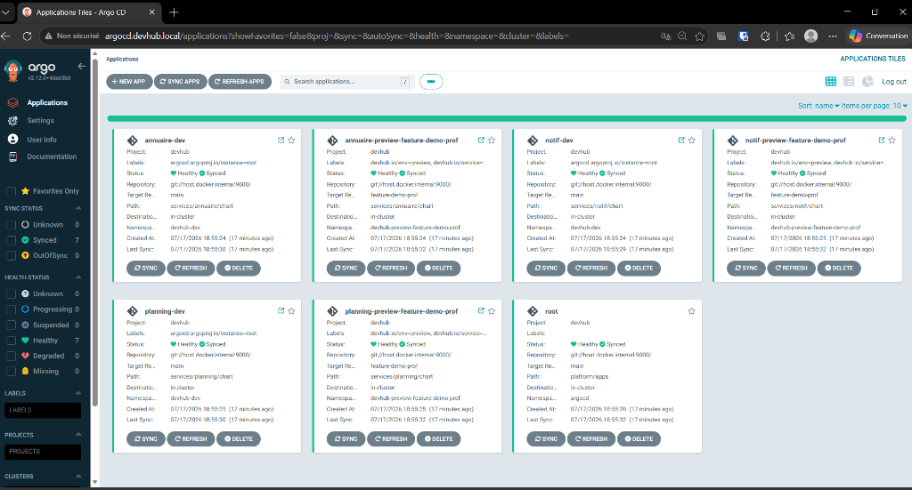
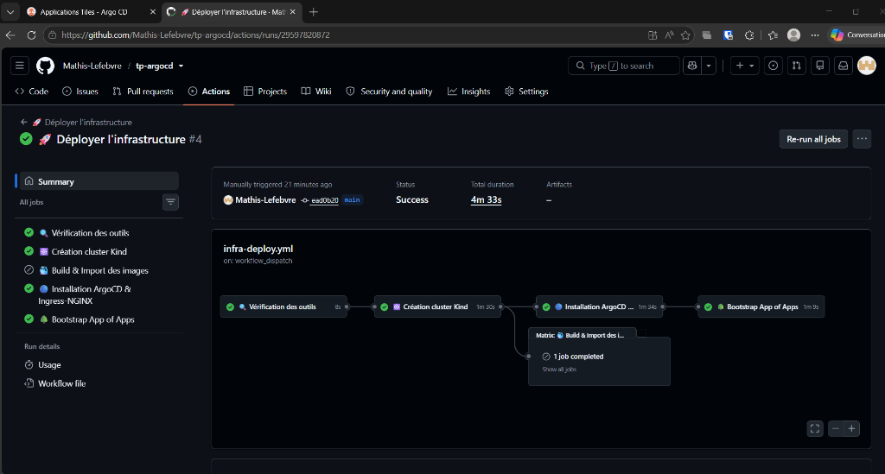

# Compte-rendu de TP — GitOps & ArgoCD (DevHub Campus)
**5ESGI SRC**  
**Étudiants :** Mathis Lefebvre & Evan Lefebvre

---

## 1. Versions des outils (Étape 0)
Pour ce TP, voici l'environnement de dev qu'on a configuré :

* **kubectl** : `Client Version: v1.34.1` / `Kustomize Version: v5.7.1`
* **Helm** : `v3.21.0` (commit `e0878d41b711792be60777fd65ad23a101e6b85f`)
* **ArgoCD CLI** : `v3.4.2+0dc6b1b` (Go `v1.26.0`)
* **Kind** : `v0.24.0` (sur control-plane de 2 nœuds)
* **Docker Engine** : `v27.x.x`

---

## 2. Notre glossaire GitOps (Étape 2)
* **AppProject** : C'est la ressource ArgoCD qui sert à mettre des barrières de sécurité (RBAC). On y définit quels dépôts Git sont autorisés, sur quels clusters/namespaces on a le droit de déployer, et les types de ressources autorisées (pour éviter qu'une appli ne crée des namespaces par exemple).
* **Application** : C'est ce qui fait le lien entre une source (dépôt Git, répertoire, branche/tag) et une destination (namespace/cluster K8s). C'est là qu'on configure les options de synchronisation automatique ou manuelle.
* **ApplicationSet** : C'est un générateur d'Applications. Au lieu d'écrire 50 fichiers d'Application à la main, on écrit un template d'ApplicationSet et un générateur (Git, PR, List...) qui crée les ressources d'Application à la volée.
* **Boucle de réconciliation** : Le mécanisme central du contrôleur d'ArgoCD qui tourne en tâche de fond. Il compare toutes les X secondes l'état décrit dans Git et l'état réel sur le cluster. S'il y a un décalage, il remonte une alerte ou corrige tout seul.
* **Self-Healing** : Si quelqu'un modifie une ressource directement sur le cluster (par exemple avec un `kubectl edit`), le contrôleur ArgoCD va écraser la modif manuelle pour remettre ce qui est écrit dans Git.
* **Pruning** : C'est le fait de supprimer automatiquement du cluster les ressources Kubernetes dont on a supprimé le code/fichier dans le dépôt Git.
* **Drift** : Le décalage (dérive) constaté entre la config déclarée dans le Git et les ressources physiques déployées sur K8s.
* **Sync Wave** : C'est une annotation (`argocd.argoproj.io/sync-wave`) qui permet d'ordonner le déploiement de nos composants (par exemple déployer d'abord la base de données avant de lancer le backend).

---

## 3. Le GitOps en résumé (Étape 2)
Le GitOps se base sur quatre piliers :
1. Une description déclarative (tout notre cluster est décrit sous forme de YAML/Helm).
2. Git comme unique source de vérité (tous les changements passent par des commits/PRs, ce qui donne un historique clair).
3. Application automatique (un agent interne applique les modifs automatiquement sans intervention humaine).
4. Réconciliation et correction des dérives en continu.

### Push vs. Pull
* **En mode Push (CI classique)** : Le runner de CI (GitHub Actions) a les clés admin du cluster et pousse les modifs avec un `kubectl apply`. C'est un risque de sécurité car si la CI est compromise, le pirate a accès au cluster entier.
* **En mode Pull (GitOps)** : C'est l'agent ArgoCD (qui tourne *dans* le cluster) qui vient lire le dépôt Git et applique les changements en local. Aucun droit d'accès admin du cluster n'est exposé à l'extérieur.

---

## 4. Choix d'implémentation Docker et Helm (Étapes 3 & 4)

### Côté Docker (Containerisation)
* **Multi-stage builds** : On a séparé la phase de compilation (Go, npm) de l'image de run finale pour ne pas embarquer d'outils inutiles.
* **Images minimales** :
  * `annuaire` : basé sur `node:20-alpine` (~130 Mo).
  * `planning` : basé sur `python:3.12-slim` avec un venv sans dépendances de build (~155 Mo).
  * `notif` : binaire Go statique copié dans un `distroless/static-debian12` (~22 Mo seulement et pas de shell disponible).
* **Runtime non-root** : On a forcé l'utilisation d'utilisateurs non-privilégiés (`node` ou `nonroot`) et des ports d'écoute non-privilégiés (port `8080`).

### Côté Helm & Kubernetes
* **Labels** : Utilisation des labels standards OCI et Kubernetes dans nos helpers.
* **Sécurité Pod/Container** : On a durci les SecurityContexts avec `runAsNonRoot: true`, `allowPrivilegeEscalation: false`, et `readOnlyRootFilesystem: true` (racine en lecture seule pour bloquer les écritures malveillantes).
* **Sondes** : Configuration systématique des `livenessProbe` et `readinessProbe` sur `/healthz`.
* **Ressources** : Définition des requêtes et limites de CPU/mémoire pour éviter que nos conteneurs ne saturent le cluster.

---

## 5. Pourquoi "App of Apps" ? (Étape 6)
Pourquoi ne pas faire juste un `kubectl apply -f apps/dev/` ?
* **Nettoyage automatique** : `kubectl apply` ne supprime rien si on retire un fichier YAML. ArgoCD détecte les suppressions dans le dépôt Git et supprime la ressource correspondante du cluster (pruning).
* **Gestion des dérives** : Un `kubectl apply` n'empêchera pas un développeur de modifier à la main un déploiement sur le cluster. ArgoCD le verra et le corrigera.
* **Visibilité** : Avec App of Apps, toutes nos applications filles sont reliées à une application racine (`root`). On a un arbre complet de dépendance visible dans l'UI d'ArgoCD.

---

## 6. ApplicationSets et previews éphémères (Étape 7)
* **Générateur choisi** : En conditions réelles, on utiliserait le *Pull Request Generator* pour lier les déploiements aux ouvertures/fermetures de PR. Pour notre maquette locale (sans token d'API GitHub externe), on a opté pour un *List Generator* paramétrable avec une branche de test (`feature-demo-prof`).
* **Dynamisation** :
  * Les namespaces sont créés à la volée avec le nom de la branche : `devhub-preview-{{branch_slug}}`.
  * Les hôtes Ingress sont surchargés pour être uniques : `annuaire-{{branch_slug}}.devhub.local`.
  * Le nettoyage est automatique : dès que la branche est retirée du code, ArgoCD supprime le namespace de preview grâce au `prune: true`.

---

## 7. Les tests de comportement ArgoCD (Étape 8)

* **Scénario 1 (Drift manuel)** : On a scalé manuellement le déploiement `annuaire` à 3 réplicas. L'application est passée en `OutOfSync` sur l'UI, et ArgoCD l'a immédiatement ramené à 1 réplica tout seul grâce au `selfHeal: true`.
* **Scénario 2 (Drift persistant)** : En coupant l'auto-sync sur `planning-dev`, nos modifs manuelles sont restées actives. ArgoCD affichait l'appli en jaune/orange (`OutOfSync`) mais n'y a pas touché tant qu'on n'a pas cliqué sur "Sync".
* **Scénario 3 (Pruning)** : En retirant la ressource Ingress de `notif` de notre code Helm, ArgoCD a instantanément supprimé la ressource physique sur le cluster K8s après notre push.
* **Scénario 4 (Rollback UI)** : On a testé le rollback manuel depuis l'UI d'ArgoCD suite à un déploiement foireux. Ça fonctionne bien pour corriger l'urgence, mais cela met l'appli en `OutOfSync` permanent car le dépôt Git contient toujours le mauvais commit. La vraie solution propre en GitOps est de faire un `git revert`.
* **Scénario 5 (PreSync Hooks)** : On a testé un job annoté en `PreSync`. ArgoCD le lance et attend qu'il se termine avec succès avant de mettre à jour le déploiement applicatif.
* **Scénario 6 (Sync Waves)** : On a attribué des valeurs de wave différentes (ex: base de données à -1, API à 0, front à 1) et on a constaté qu'ArgoCD respecte bien cette séquence lors de la synchronisation.

---

## 8. Sécurité et monitoring (Étape 9)

### RBAC
On a créé un compte `developer` restreint dans `platform/argocd/values.yaml` :
* Il peut lister et lire toutes les applications pour avoir de la visibilité.
* Il a uniquement le droit de synchroniser (`sync`) les applications qui touchent au service `annuaire` (bloqué pour `planning` et `notif`).

On a pu valider les règles en ligne de commande :
* `argocd app sync annuaire-dev` -> Passe avec succès.
* `argocd app sync planning-dev` -> Bloqué avec une erreur `permission denied`.

### Métriques utiles pour la prod
1. `argocd_app_info` : pour suivre l'état de santé (`Healthy`/`Degraded`) et de synchro de nos applis dans nos dashboards Grafana.
2. `argocd_app_reconcile_duration_seconds` : pour mesurer le temps que met le contrôleur à comparer le Git et le cluster (pratique pour repérer les surcharges).
3. `argocd_app_sync_total` : pour compter le nombre de synchros lancées et détecter d'éventuelles boucles de synchronisation infinies.

### Alertes & Notifications
On a activé le module de notifications intégré d'ArgoCD et configuré un webhook vers `webhook.site`. Dès qu'une application passe au statut `Failed`, ArgoCD pousse un JSON contenant le nom de l'app, le commit cible et le détail de l'erreur Kubernetes.

---

## 9. Analyse comparative (Étape 11)

### Tableau comparatif

| Critère | Flux v2 | Argo CD | Helm (Direct) |
| :--- | :--- | :--- | :--- |
| **Modèle** | Pull | Pull | Push |
| **Interface Graphique** | Non (via extensions tierces) | Oui (UI native géniale) | Non |
| **Gestion du Drift** | Auto-correction | Auto-correction | Non gérée |
| **Multi-tenancy & RBAC** | Basé sur le RBAC K8s | RBAC interne propre | RBAC du compte de CI |
| **App of Apps** | Via dépendances Kustomize | Via App of Apps / Sync Waves | Via sous-charts Helm |

### Gestion des risques en production
Déployer ArgoCD brut présente des risques de sécurité majeurs qu'il faut couvrir :
1. **Accès en écriture sur Git** : Si un pirate contrôle le dépôt Git, il contrôle votre cluster. *Solution* : Protéger les branches principales, exiger des revues de code (PR) et signer les commits.
2. **Secrets stockés dans Git** : Ne jamais stocker de mots de passe en clair dans Git. *Solution* : Utiliser Sealed Secrets (chiffré dans le Git) ou brancher External Secrets Operator pour tirer les secrets d'un Vault.
3. **Privilèges d'ArgoCD** : Le contrôleur a souvent des droits de `cluster-admin`. *Solution* : Limiter la portée d'ArgoCD via les `AppProject` et restreindre les namespaces cibles.

---

## 10. Historique des commandes lancées durant le TP
Voici en gros l'enchaînement des commandes qu'on a utilisées :

```bash
# Vérif et démarrage
make tools-check
make cluster-up

# Config DNS Windows hosts & WSL
sudo bash -c "echo -e '\n127.0.0.1  argocd.devhub.local\n127.0.0.1  annuaire.devhub.local\n127.0.0.1  planning.devhub.local\n127.0.0.1  notif.devhub.local' >> /etc/hosts"

# Build et import des images dans Kind
docker build -t ghcr.io/binome/annuaire:dev services/annuaire
docker build -t ghcr.io/binome/planning:dev services/planning
docker build -t ghcr.io/binome/notif:dev services/notif
kind load docker-image ghcr.io/binome/annuaire:dev --name devhub
kind load docker-image ghcr.io/binome/planning:dev --name devhub
kind load docker-image ghcr.io/binome/notif:dev --name devhub

# Démarrage du serveur git local pour ArgoCD
git daemon --base-path=. --export-all --enable=receive-pack --reuseaddr --port=9000 --verbose &

# Installation de la stack ArgoCD
make argocd-install
make argocd-password

# Bootstrapping (App of Apps)
kubectl apply -f platform/projects/devhub.yaml
kubectl apply -f platform/bootstrap/root-app.yaml

# Test des previews sur branche feature
git checkout -b feature-demo-prof
git commit -am "fix preview configurations"
git push git://127.0.0.1:9000/ feature-demo-prof
argocd app sync root --prune
argocd app get annuaire-preview-feature-demo-prof --refresh
argocd app sync annuaire-preview-feature-demo-prof

# Test du RBAC developer
argocd login argocd.devhub.local --insecure --username developer --password developerpassword
argocd app sync annuaire-dev    # OK
argocd app sync planning-dev    # Bloqué (Permission Denied)
```

---

## 11. Validation visuelle et résultats (Captures d'écran)

Voici les résultats visuels attestant du bon fonctionnement de notre infrastructure et de sa chaîne d'intégration continue :

### A. Vue d'ensemble de l'interface ArgoCD
Toutes les applications définies dans notre mono-repo (modèle App of Apps) sont synchronisées avec succès (`Synced`) et dans un état sain (`Healthy`) :



### B. Automatisation de l'infrastructure via GitHub Actions
Le déploiement complet de l'infrastructure locale (Kind + ArgoCD + Ingress + Bootstrap App of Apps) a été réalisé avec succès en un clic depuis GitHub Actions via notre runner local :



